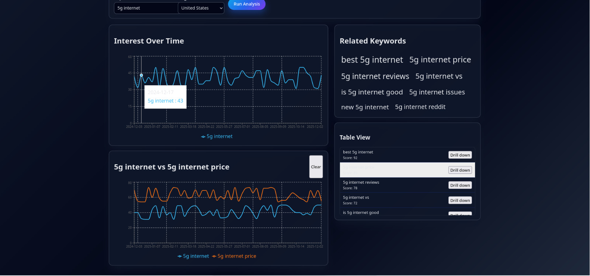
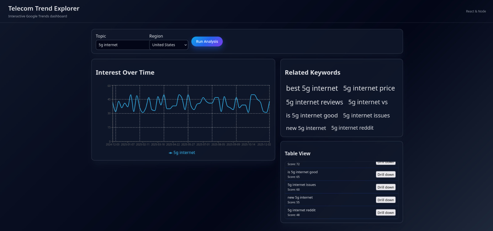
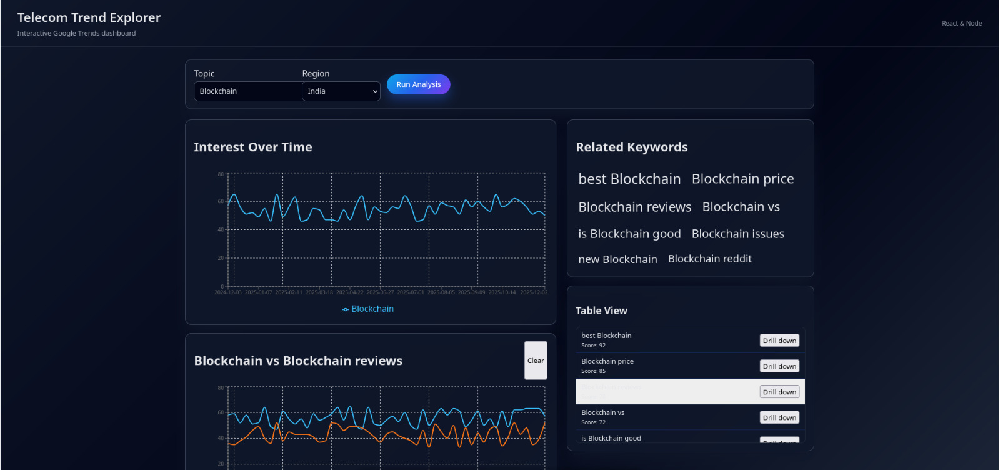

**Project Overview**

- **Name:** CharterProjectDemo
- **Location:** `telecom-trends/`

**Outputs**

- Output 1


- Output 2


- Output 3


If the `Screenshots/` images are not present, open the app and navigate to the relevant view to generate the output visuals.

**Prerequisites**

- **Node.js & npm:** Install Node.js (LTS recommended) which includes `npm`.
- **OS:** Instructions shown use Windows PowerShell; adapt `cd` commands for other shells.

**Start the Backend**

1. Open a PowerShell terminal.
2. Change directory to the backend folder and install dependencies:

```powershell
cd telecom-trends/backend
npm install
```

3. Start the backend server (development):

```powershell
npm run dev
```

Or start the production server:

```powershell
npm start
```

The backend uses `index.js` (Express) and depends on `cors`, `express` and `google-trends-api`.

**Start the Frontend**

1. Open a separate PowerShell terminal.
2. Change directory to the frontend folder and install dependencies:

```powershell
cd telecom-trends/frontend
npm install
```

3. Start the React development server:

```powershell
npm start
```

This runs `react-scripts start` and opens the app at `http://localhost:3000` by default.

**Run Both (recommended)**

- Open two terminals — one for backend and one for frontend — and run the respective commands above.
- Ensure the backend is running before using features that fetch trends from the server.

**Troubleshooting**

- If a port is busy, either stop the conflicting process or change the port in the app configuration.
- If `npm install` fails, ensure Node.js is installed and your network/firewall allows package downloads.
- For backend errors, check `telecom-trends/backend/index.js` and the console logs.

**Files Changed**

- Updated `README.md` (project root) with outputs and start instructions.

If you'd like, I can also add example screenshots to `Screenshots/` and add an npm script to run frontend and backend concurrently.
